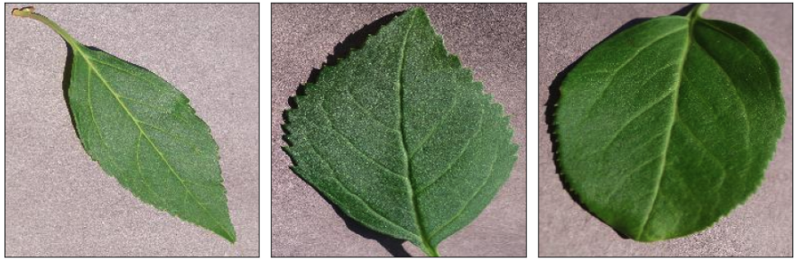
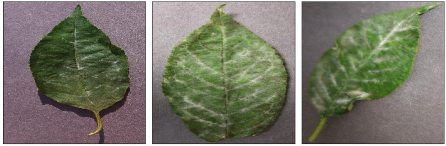
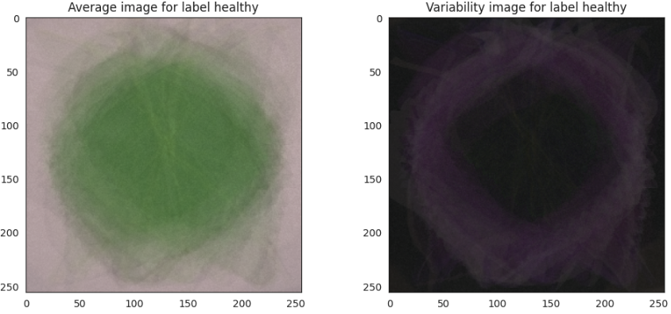
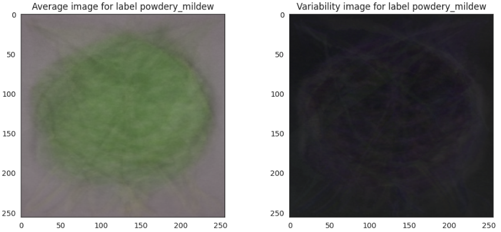

# Mildew detection tool for cherry leaves

# Introduction
The cherry plantation crop from Farmy & Foods is facing a challenge where their cherry plantations have been presenting powdery mildew. Currently, the process is manual verification if a given cherry tree contains powdery mildew. An employee spends around 30 minutes in each tree, taking a few samples of tree leaves and verifying visually if the leaf tree is healthy or has powdery mildew. If there is powdery mildew, the employee applies a specific compound to kill the fungus. The time spent applying this compound is 1 minute. The company has thousands of cherry trees located on multiple farms across the country. As a result, this manual process is not scalable due to the time spent in the manual process inspection.

To save time in this process, the IT team suggested an ML system that detects instantly, using a leaf tree image, if it is healthy or has powdery mildew. A similar manual process is in place for other crops for detecting pests, and if this initiative is successful, there is a realistic chance to replicate this project for all other crops. The dataset is a collection of cherry leaf images provided by Farmy & Foods, taken from their crops.

### Deployed version at https://cherry-leaves-mildew-detection.onrender.com/

# Table of Contents
- [Mildew detection tool for cherry leaves](#mildew-detection-tool-for-cherry-leaves)
- [Introduction](#introduction)
    - [Deployed version at https://cherry-leaves-mildew-detection.onrender.com/](#deployed-version-at-httpscherry-leaves-mildew-detectiononrendercom)
- [Table of Contents](#table-of-contents)
  - [Dataset Content](#dataset-content)
  - [Business Requirements](#business-requirements)
  - [Hypothesis and validation](#hypothesis-and-validation)
  - [Rationale for ML model](#rationale-for-ml-model)
  - [Implementation of the Business Requirements](#implementation-of-the-business-requirements)
  - [ML Business case](#ml-business-case)
    - [Business Case understanding and ML validation](#business-case-understanding-and-ml-validation)
  - [ML Business Case](#ml-business-case-1)
  - [The rationale to map the business requirements to the Data Visualisations and ML tasks](#the-rationale-to-map-the-business-requirements-to-the-data-visualisations-and-ml-tasks)
  - [Dashboard design](#dashboard-design)
  - [Unfixed Bugs](#unfixed-bugs)
  - [Deployment](#deployment)
    - [Render](#render)
  - [Technologies used](#technologies-used)
    - [Main Data Analysis and Machine Learning Libraries](#main-data-analysis-and-machine-learning-libraries)
  - [Testing](#testing)
  - [Credits](#credits)
    - [Content](#content)
    - [Media](#media)
  - [Acknowledgements (optional)](#acknowledgements-optional)

## Dataset Content

- The dataset is sourced from [Kaggle](https://www.kaggle.com/datasets/codeinstitute/cherry-leaves/) and contains 4208 images of cherry leaves images. The images are split into two classes: healthy leaves and leaves that contain Mildew, a generally white powdery substance which can be found on the leaves. This type of fungal disease can affect many plant species, which makes this project valuable across the agricultural sector.

Overall the images are of a good quality and have normal (RGB) colors. The dataset was collected to train a machine learning model which could be used to predict whether the leaf on the image is healthy or would contain the powdery mildew.

The cherry plantation crop is one of the finest products in their portfolio, and the company is concerned about supplying the market with a compromised quality product.

- The dataset contains +4 thousand images taken from the client's crop fields. The images show healthy cherry leaves and cherry leaves that have powdery mildew, a fungal disease that affects many plant species. 

[Back to top ⇧](#table-of-contents)

## Business Requirements

Marianne McGuineys, the head of IT and Innovation at Farmy & Foods, a company in the agricultural sector that produces and harvests different types of food. Is facing a challenge where their cherry plantations have been presenting powdery mildew, which is a fungal disease that affects a wide range of plants.

The IT team first of all is interested in completing a study that can clearly show the differences between a Healthy cherry leave and one that contains powdery mildew. For this they are hoping to find visual indicators. They are also looking to create a realable tool that is capable of detecting instantly, using a tree leaf image, if it is healthy or has powdery mildew (Business Requirement 2). This tool needs to have a degree of accuracy of at least 97% for it to be relevant to the client.

The client already has done the work and assembled 4208 images of cherry leaves, of which 2104 are images of healthy leaves and 2104 images are of images containing powdery mildew. To make the tool useable for real life application, they require an online dashboard that provides information and allows them to upload images of leaves, predicting whether these leaves are healthy or infected. As part of their NDA, this dashboard and its content will only be made accessable to Farmy & Foods.

This project is essential to Farmy & Foods as it will allow them to ensure that they do not compromise the quality of their main product and continue to supply the market with high quality product.

Summarized:
1. Create an understanding of the visual differences between healty leaves and leaves containing the mildew fungus.
2. Create a tool that can predict with at least a 97% accuracy whether a leave is healthy or infected.
3. Make this information avaialbe in an easy to use dashboard.

[Back to top ⇧](#table-of-contents)

## Hypothesis and validation

**Hypothesis 1:**
It is possible through visual cues to differintiate a healthy cherry leave, from a cherry leave containing powdery mildew.

Valitation:
review images and determine whether there are specific indicators that can be viewed, determining if a leave is healthy or containing powdery mildew.

This hypothesis can be considered validated. It is indeed possible to use visual cues to indicate whether a cherry leave is healty or if it contains the powdery mildew. The study shows that: 

* Healthy leaves are of a consistant and brighter green color, with strong lines (veines) and texture.
* Leaves with mildew do not have a consistant green color (irregular), have unclear lines and have visually white collored textures, covering the leaves. This is also more prudent in the veins of the leaves.

These visual cues can be seen by the human eye and can be used for training ML models.

Healthy cherry leaves

Cherry leaves containing Mildew

As part of the first business requirement, it was also requested to provide average images and variability images for each class (healthy or powdery mildew).

Average and Variability images for healthy leaves

 

Average and Variability images for infected leaves (containing powdery mildew)

 

**Hypothesis 2**
Based on visible indicators, it can be predicted with a 97% accuracy if a leave is healthy, or containing powdery mildew.

Valitation:
A CNN model will be trained, tested and used on a validation set of images to determine if this is possible.

This hypothesis can be considered validated. The tool that was created can predict, when using images of cherry leaves,  with a degree of 99% accuracy whether the leave in the image is healthy or if it was infected with the mildew fungus.

**Hypothesis 3**
By using a trained CNN model, time spend & costs for cherry leaves health checks can be drastically reduced.

Validation:
Taking in account the time/cost needed to make pictures, upload them and have the CNN model run over them, a comparison can be made between these actions and the 30 minutes per tree that it costs today to verify if a Cherry tree is healthy, or infected with Mildew.

This hypothesis can not yet be considered fully validated. But it is still the expectation that it will be. Looking at the time spend when using the tool (and the ability to review batches of images at the same time), it would require only an economical beneficial way to collect and upload the images to make this approach financially more beneficial, than the current manual way of working. 

[Back to top ⇧](#table-of-contents)

## Rationale for ML model

The client has a very valid rationale for using a machine learning model to help their need for quality control. The current time spend on each tree, is 30 minutes. This is done manually by a specialist. A specialty that needs to be taugt to the individual and needs to be taught to several as this can not be done by one person. They are reliant on wheather, time and the required skills. By training a model to detect the mildew fungus on leaves, the work can be done by many, also without extensive training. Pictures would need to be collected, documented correctly and uploaded. But this can be done at any time of the day, in any weather, effectively by anyone.

Practically, they have also taken the time to create a sufficiently large data set of healthy and infected leaves which would have been the largest cost (time/work) in this process for them. By using the created CNN model, quality checks can be done online to ensure that what the model indicates as healthy or infected, is still correct. Additionally the model could be used and trained on leaves of other plants/trees that they have in their portfolio, allowing them to save further time and work.

Essentially for Farmy Foods going forward is creating a reliable workflow of collecting leaf images of their trees/plants, a way to upload, document and track them. This to ensure they know which tree was determined healty/infected at which specific time and place. This is however outside of the scope of this machine learning project and would be an advice to the client directly.

[Back to top ⇧](#table-of-contents)

## Implementation of the Business Requirements

**User stories**
1. Information gathering and data collection.
    - As a client I gather images and store them in one place so that they can be easily downloaded.
      - AC 1 - Images can be uploaded and downloaded from Kaggle.

    - As the developer I can use all provided images without concern so that the ML tool can use it for training.
      - AC 1 - All images in dataset are functioning.
      - AC 2 - All images in dataset are the correct/same size.
      - AC 3 - ML tool responds to all images correctly.

2. Data visualization, cleaning, and preparation.
    - As a client I can visually differentiate between healthy and infected leaves so that I understand the difference.
      - AC 1 - Clear visual guidance is provided whether a leaf is healty of infected.
      - AC 2 - There is a montage available to see the differences between healthy and infected leaves.
  
    - As a developer I have a clear dataset of images so that I can train the ML tool.
      - AC 1 - Image dataset is large enough to split into train, test, validation.
      - AC 2 - I can determine the image average and variability for each class (healthy and infected).

3. Model training, optimization and validation.
    - As a developer I can use the provided dataset to train the CNN model.
      - AC 1 - The data set has clear labels for its classes.
      - AC 2 - the image shape for that images is correctly determined.
      - AC 3 - Image dataset is large enough to split into train, test, validation.
      - AC 4 - Image augmentation is possible to increase training data for the CNN model.
    
    - As a developer I have the space/time to trial different settings so that the highest success can be obtained.
      - AC 1 - Time is made available to train the model.
      - AC 2 - Different "loss functions", Optimizers and "activation functions" can be tested.

4. Dashboard planning, designing, and development.
    - As a client I can define what I find relevant information so that the dashboard fits my needs.
      - AC 1 - Dashboard contains study information on the visual cues between healthy infected leaves.
      - AC 2 - It is possible for the clients IT team to understand how the model worked.
      - AC 3 - Client has been able to provide their priorities for the dashboard.
      - AC 4 - Client is able to upload images of leaves that they want to have tested and receive immediate feedback.
      - AC 5 - It is clear for the client what can be found on the dashboard.
      - AC 6 - When predictions on leaf healthy are made, the client can see that the degree of accuracy is >97%.
     
    - As a developer I can provide context on what is possible in the dashboard so that I can match the clients expectations.
      - AC 1 - Developer has been part of the dashboard conversations.
      - AC 2 - Developer has been made aware of clients needs/priorities.

5. Dashboard deployment and release.
   - As a client I have easy access to the dashboard so that it can be used without challenge.
     - AC 1 - An easy to use platform has been chosen to host the platform.
     - AC 2 - Platform is avaiable in the browser for easy/quick access. 
   
   - As a developer I can update the dashboard after deployment so that I can ensure it remains up to date.
     - AC 1 - chosen platform should be available also after deployment.
     - AC 2 - changes can me made/prepared without it directly impacting deployment, only when chosen to do so.

[Back to top ⇧](#table-of-contents)

## ML Business case

### Business Case understanding and ML validation

    
<strong>Business case assessment</strong>

    <table>
        <thead>
            <tr>
                <th>Ask</th>
                <th>Requirements</th>
                <th>Pass/Fail</th>
            </tr>
        </thead>
        <tbody>
            <tr>
                <td>1. What are the business requirements?</td>
                <td>
                - The client is interested in conducting a study to visually differentiate a cherry leaf that is healthy from one that contains powdery mildew. 
                - The client is interested in predicting if a cherry leaf is healthy or contains powdery mildew.
                </td>
                <td>
                <!-- &#10003; -->
                </td>
            </tr>
            <tr>
                <td>2. Is there any business requirement that can be answered with conventional data analysis?</td>
                <td>
                - Yes, we can use conventional data analysis to conduct a study to visually differentiate a cherry leaf that is healthy from one that contains powdery mildew.
                </td>
                <td>
                <!-- &#10003; -->
                </td>
            </tr>
            <tr>
                <td>3. Does the client need a dashboard or an API endpoint?</td>
                <td>- The client needs a dashboard.</td>
                <td>
                <!-- &#10003; -->
                </td>
            </tr>
            <tr>
                <td>4. What does the client consider as a successful project outcome?</td>
                <td>
                - A study showing how to visually differentiate a cherry leaf that is healthy from one that contains powdery mildew. 
                - Also, the capability to predict if a cherry leaf is healthy or contains powdery mildew.</td>
                <td>
                <!-- &#10003; -->
                </td>
            </tr>
            <tr>
                <td>5. Can you break down the project into Epics and User Stories?</td>
                <td>
                - Information gathering and data collection. 
                - Data visualization, cleaning, and preparation. 
                - Model training, optimization and validation. 
                - Dashboard planning, designing, and development. 
                - Dashboard deployment and release.
                </td>
                <td>
                <!-- &#10003; -->
                </td>
            </tr>
            <tr>
                <td>6. Ethical or Privacy concerns?</td>
                <td>
                - The client provided the data under an NDA (non-disclosure agreement), therefore the data should only be shared with professionals that are officially involved in the project.
                </td>
                <td>
                <!-- &#10003; -->
                </td>
            </tr>
            <tr>
                <td>7. Does the data suggest a particular model?</td>
                <td>
                - The data suggests a binary classifier, indicating whether a particular cherry leaf is healthy or contains powdery mildew.
                </td>
                <td>
                <!-- &#10003; -->
                </td>
            </tr>
            <tr>
                <td>8. What are the model's inputs and intended outputs?</td>
                <td>
                - The input is a cherry leaf image and the output is a prediction of whether the cherry leaf is healthy or contains powdery mildew.
                </td>
                <td>
                <!-- &#10003; -->
                </td>
            </tr>
            <tr>
                <td>9. What are the criteria for the performance goal of the predictions?</td>
                <td>- We agreed with the client a degree of 97% accuracy.</td>
                <td>
                <!-- &#10003; -->
                </td>
            </tr>
            <tr>
                <td>10. How will the client benefit?</td>
                <td>- The client will not supply the market with a product of compromised quality.</td>
                <td>
                <!-- &#10003; -->
                </td>
            </tr>
        </tbody>
    </table>

[Back to top ⇧](#table-of-contents)

## ML Business Case
**In the previous bullet, you potentially visualised an ML task to answer a business requirement. You should frame the business case using the method we covered in the course.**

    
<strong>Project Considerations</strong>

    <table>
        <thead>
            <tr>
                <th>Business Requirements</th>
                <th>Requirements</th>
                <th>Pass/Fail</th>
            </tr>
        </thead>
        <tbody>
            <tr>
                <td>BR 1</td>
                <td>
                Your study should include at least analysis on: 
                - average images and variability images for each class (healthy or powdery mildew), 
                - the differences between average healthy and average powdery mildew cherry leaves, 
                - an image montage for each class.
                </td>
                <td>
                <!-- &#10003; -->
                </td>
            </tr>
            <tr>
                <td>BR 2</td>
                <td>
                - You may deliver an ML system that is capable of predicting whether a cherry leaf is healthy or contains powdery mildew. In this case, we suggest to use Neural Networks to map the relationships between the features and the labels.  
                - You will notice when exploring the dataset that the images are 256 pixels × 256 pixels. When defining your image shape to load the images to memory for training the model, you may choose 256 × 256 as your image shape. However, that will lead to a trained model that will likely be larger than 100Mb. This is fine as long as the model meets the project requirement, the caveat is that you may need to use Git LFS (Large File Storage) to push files larger than 100Mb to GitHub. As a result, we suggest you consider using an image shape that is smaller, like 100 × 100 or 50 × 50, with the expectation that the model would still meet the performance requirement and will be smaller than 100Mb for a smoother push to GitHub.
                </td>
                <td>
                <!-- &#10003; -->
                </td>
            </tr>
        </tbody>
    </table>

[Back to top ⇧](#table-of-contents)

## The rationale to map the business requirements to the Data Visualisations and ML tasks
**List your business requirements and a rationale to map them to the Data Visualisations and ML tasks.**

## Dashboard design

    
<strong>Dashboard Expectations</strong>

    <table>
        <thead>
            <tr>
                <th></th>
                <th>Expectation</th>
                <th>Pass/Fail</th>
            </tr>
        </thead>
        <tbody>
            <tr>
                <td>1.</td>
                <td>
                A project summary page, showing the project dataset summary and the client's requirements.
                </td>
                <td>
                <!-- &#10003; -->
                </td>
            </tr>
            <tr>
                <td>2.</td>
                <td>
                A page listing your findings related to a study to visually differentiate a cherry leaf that is healthy from one that contains powdery mildew.
                </td>
                <td>
                <!-- &#10003; -->
                </td>
            </tr>
            <tr>
                <td>3.</td>
                <td>A page containing: 
                -  A link to download a set of cherry leaf images for live prediction (you may use the Kaggle repository that was provided to you). 
                - A User Interface with a file uploader widget. The user should have the capacity to upload multiple images. For each image, it will display the image and a prediction statement, indicating if a cherry leaf is healthy or contains powdery mildew and the probability associated with this statement. 
                - A table with the image name and prediction results, and a download button to download the table.
                </td>
                <td>
                <!-- &#10003; -->
                </td>
            </tr>
            <tr>
                <td>4. </td>
                <td>A page indicating your project hypothesis and how you validated it across the project.</td>
                <td>
                <!-- &#10003; -->
                </td>
            </tr>
            <tr>
                <td>5.</td>
                <td>A technical page displaying your model performance.</td>
                <td>
                <!-- &#10003; -->
                </td>
            </tr>
        </tbody>
    </table>

Page 1. - Project summary  
Page 2. - Study findings determining healthy leaves and leaves with powdery_mildew  
Page 3. - Predictor tool with capabilities of using existing images or images uploaded by user  
Page 4. - Project hypothesis and validation  
Page 5. - Technical page showing model performance  

**List all dashboard pages and their content, either blocks of information or widgets, like buttons, checkboxes, images, or any other items, that your dashboard library supports.**
**Finally, during the project development, you may revisit your dashboard plan to update a given feature (for example, at the beginning of the project, you were confident you would use a given plot to display an insight, but later, you chose another plot type).**

Page 1: Project Summary
Quick project summary
**General Information**
ABC

**Project Dataset**
The available dataset contains ...

Link to additional information (Readme file)
Business requirements
- ABC
- DEF

Page 2: Cells Visualizer
It will answer business requirements 1
Checkbox 1 - Difference between average and variability image  
Checkbox 2 - Differences between average parasitised and average uninfected cells  
Checkbox 3 - Image Montage  

Page 3: Malaria Detection
Business requirement two information - "The client is interested in telling whether a given cell contains malaria parasite or not."
Link to download a set of parasite-contained and uninfected cell images for live prediction.
Create a user interface with a file uploader widget. The user should upload multiple malaria cell images. It will display the image and a prediction statement, indicating if the cell is infected or not with malaria and the probability associated with this statement.
Table with the image name and prediction results.
Download button to download table.

Page 4: Project Hypothesis and Validation
Block for each project hypothesis, describe the conclusion and how you validated it.
Page 5: ML Prediction Metrics
Label Frequencies for Train, Validation, and Test Sets
Model History - Accuracy and Losses
Model evaluation result

[Back to top ⇧](#table-of-contents)

## Unfixed Bugs

* After collecting the data and visualizing the data, I ran into a 'bug' that I could not seem to fix in the beginning. When I ran the model, the epochs would end after 4 or 5 runs. After trying to update the criteria I also received the error that the tensorflow packages might have been incorrectly installed.
* The original CNN model was overfitted, so I halved the filters in the second layer of the model from 64 to 32. This helped the model become more accurate. However loss and val_accuracy were still nog fully in line, although the estimated accuracy of the model to determine the right class was 99.99998%. So I was unclear on if I should reset the model again to get a better aligned performance between loss and val_accuracy, as it still seemed over fitted. In which case I should try out different combinations with the hyperparameters.
  * metrics tried: Adam / Adagrad / RMSprop
  * Loss tried : binary_crossentropy / categorical_crossentropy
  * v1 - binary_crossentropy + Adam : 99%+ acc. 11 epochs
  * v3 - binary_crossentropy + Adagrad :90%+ acc. 29 epochs
  * v4 - categorical_crossentropy + Adam: 4 epochs
* Somewhere in the modelling the definition of 0 = healthy and 1 = powdery_mildew got reversed.

[Back to top ⇧](#table-of-contents)

## Deployment

### Render

- The App live link is: `https://YOUR_APP_NAME.herokuapp.com/`
- Set the runtime.txt Python version to a [Heroku-20](https://devcenter.heroku.com/articles/python-support#supported-runtimes) stack currently supported version.
- The project was deployed to Heroku using the following steps.

1. Log in to Heroku and create an App
2. At the Deploy tab, select GitHub as the deployment method.
3. Select your repository name and click Search. Once it is found, click Connect.
4. Select the branch you want to deploy, then click Deploy Branch.
5. The deployment process should happen smoothly if all deployment files are fully functional. Click the button Open App on the top of the page to access your App.
6. If the slug size is too large, then add large files not required for the app to the .slugignore file.

[Back to top ⇧](#table-of-contents)

## Technologies used

[Back to top ⇧](#table-of-contents)

### Main Data Analysis and Machine Learning Libraries

- Here, you should list the libraries used in the project and provide an example(s) of how you used these libraries.

[Back to top ⇧](#table-of-contents)

## Testing

Instert a testing block.

[Back to top ⇧](#table-of-contents)

## Credits

- In this section, you need to reference where you got your content, media and from where you got extra help. It is common practice to use code from other repositories and tutorials. However, it is necessary to be very specific about these sources to avoid plagiarism.
- You can break the credits section up into Content and Media, depending on what you have included in your project.

### Content

- The text for the Home page was taken from Wikipedia Article A.
- Instructions on how to implement form validation on the Sign-Up page were taken from [Specific YouTube Tutorial](https://www.youtube.com/).
- The icons in the footer were taken from [Font Awesome](https://fontawesome.com/).

### Media

- The photos used on the home and sign-up page are from This Open-Source site.
- The images used for the gallery page were taken from this other open-source site.

[Back to top ⇧](#table-of-contents)

## Acknowledgements (optional)

- Mohammed Shami : mentor for this project
- Roman Rakic and the CI support team : providing answers when I was stuck and Google & ChatGPT were not able to provide an answer

[Back to top ⇧](#table-of-contents)